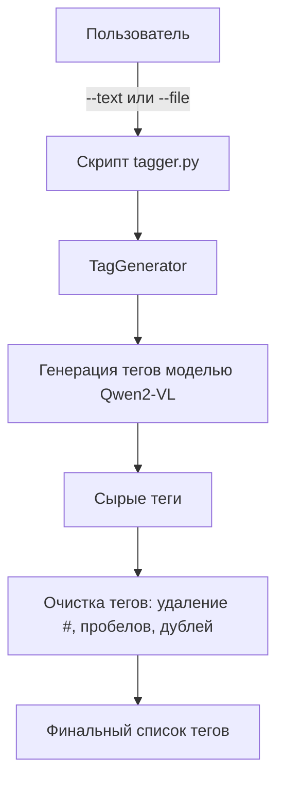

# GenAI-1-27

# Генерация тегов для текста

## Описание задачи
Задача — автоматически предлагать ключевые теги для произвольного текста.  
Теги должны быть:
- короткими (одно слово или максимум два),
- уникальными,
- отражать основное содержание текста.

---

## BASED Гайдлайн 
Базовое решение должно было выглядеть так:
1. Промпт: *"Предложи 5 тегов для текста: [текст]"*.
2. Использовать модель `text-generation`.
3. Вывести результат.
4. Удалить дубликаты.

---

## Данное решение и отличие от baseline
Слегка отошел от предложенного подхода по следующим причинам:
- Вместо `text-generation` использовал модель **Qwen2-VL** (`trl-algo/summary_tags_qwen2_v2`), так как она лучше справляется с обработкой длинных текстов и даёт более содержательные теги.
- Промпт был доработан: явно указываем формат ответа (только список тегов через запятую) и ограничиваем длину тегов.
- Добавлена очистка тегов:
  - удаляются пробелы, решётки `#` и дубликаты,
  - сортировка для стабильности результата.

Таким образом, модель не просто выдаёт "сырые" теги, а возвращает структурированный список.

---

## Baseline и метрики
- **Baseline:** просто получить теги из модели (без очистки).  
- **Метрика:** более 3 уникальных тегов в итоговом списке.  

Данное решение стабильно выдаёт >3 тегов для большинства текстов.

---

## Установка
Создайте виртуальное окружение и установите зависимости:

```bash
python -m venv venv
source venv/bin/activate   # Linux / MacOS
venv\Scripts\activate      # Windows

pip install -r requirements.txt
```

## Использование

Скрипт можно запускать двумя способами:

1. Передать текст напрямую:
```bash
python tagger.py --text "В уютном доме на солнечной поляне жили кот и пёс..."
```

2. Передать путь к файлу с текстом:
```bash
python tagger.py --file test_text.txt

```

## Пример вывода

```Сырые теги:
 Дружба, кот, лабрадор, дом, поляна 

Очищенные теги:
 ['Дружба', 'Кот', 'Лабрадор', 'Дом', 'Поляна']
```

## Граф использования



## Для вайба


